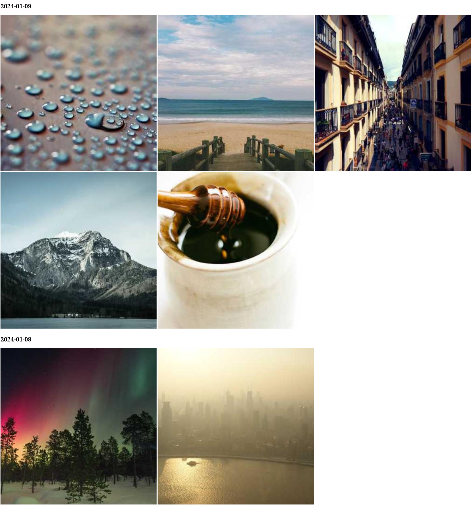

# Photostagram

Have a directory of photos and want to make a quick local web viewer?

Run this with `photostagram $path_glob_to_photos`, like `photostagram ~/Pictures/*.jpg` to generate a timeline, sorted by date (done by reading EXIF metadata).

## Example Timeline

